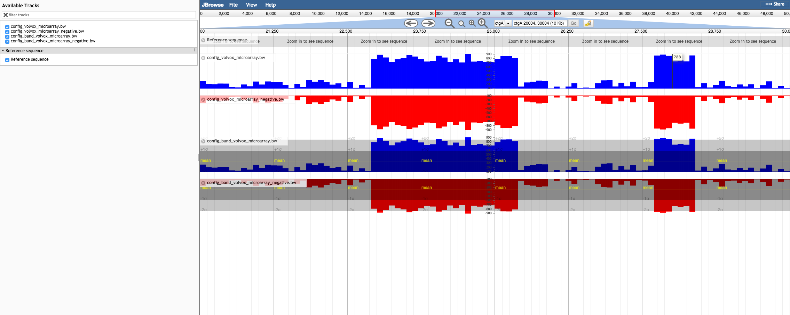

# manytracks

A small JBrowse plugin to initialize many tracks given an array of URLs, in order to alleviate the annoying-nesss of complicated setups

## Example configuation

    [manytracks.config]
    type=JBrowse/View/Track/Wiggle/XYPlot
    storeClass=JBrowse/Store/SeqFeature/BigWig
    urlTemplates+=ex1.bw
    urlTemplates+=ex2.bw
    
    [manytracks.config_band]
    variance_band=true
    type=JBrowse/View/Track/Wiggle/XYPlot
    storeClass=JBrowse/Store/SeqFeature/BigWig
    urlTemplates+=ex1.bw
    urlTemplates+=ex2.bw

The plugin will initiate a track for each file in the array of files in `urlTemplates`. This generally works best with a long list of simple track types like BAM, VCF.gz, or BigWig

## Screenshot

Simple example of the manytracks configuration, with two manytracks config blocks (one with variance band added, one without)

## Install

Clone repo into plugins folder into the JBrowse plugins folder, then name folder ManyTracks. Finally add the plugin declaration to trackList.json or jbrowse_conf.json

    "plugins": ["ManyTracks"]
    

See http://gmod.org/wiki/JBrowse_FAQ#How_do_I_install_a_plugin for more information

